## LAB4-Conceptos básicos de estilo de llamada / retorno (paralelismo y concurrencia)

Integrantes: 
		• Amalia Alfonso
		• Daniel Rosales
## Part I.I:
**1.** Ejecute y verifique cómo funciona el programa, Ejecute jVisualVM e inspeccione el uso de la CPU del proceso correspondiente.
¿Cuál es la razón de este consumo de CPU?
¿Cuál es la clase responsable de ese consumo?
> Este consumo se genera porque el Consumer mientras espera recursos no hace nada más hasta que que el producer agregue datos, es decir que se queda en una espera activa, por eso la clase responsable de ese alto consumo de CPU es la clase Consumer.

## Parte II:

**2.** Compruebe el código e identifique cómo se implementó la funcionalidad indicada. Dado el propósito del juego, un invariante debe ser que la suma de los puntos de vida de todos los jugadores sea siempre la misma. (Por supuesto, en un momento en el que no se está realizando una operación de aumento / reducción de tiempo) . Para ese caso, para los jugadores N, ¿cuál debería ser ese valor?

> En ese caso, el valor debería ser el número de jugadores N por el valor de la salud predeterminada. Es decir N*DEFAULT_IMMORTAL_HEALTH=100N

**3.** Ejecute la aplicación y verifique cómo funciona la opción "pausar y verificar", ¿está satisfecho el invariante?
> No está satisfecho el invariante porque no está deteniendo la ejecución de los inmortales. Además, hay datos corruptos porque no se están alterando correctamente los datos, dado que cualquier inmortal puede aumentar o disminuir su vida al tiempo. También se evidencia una condición de carrera porque al atacar aleatoriamente a cualquier inmortal, puede ocurrir que dos de ellos ataquen a un mismo objetivo(otro inmortal).

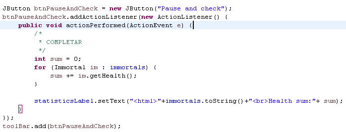

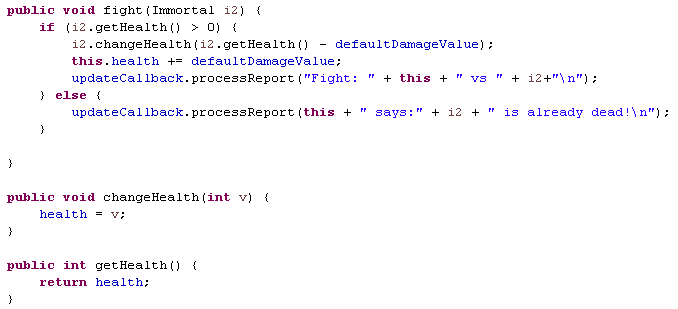

**4.** Una primera hipótesis para presentar la condición de carrera para esa función (pausar y verificar) es que el programa verifica la lista cuyos valores se van a imprimir, al mismo tiempo que otros subprocesos modifican los valores de la lista. Para resolver eso, escriba el código necesario para efectivamente, antes de imprimir los resultados actuales, pausar los otros hilos. Además, implementar la opción de reanudar.

>Pausar y Verificar:

• ControlFrame
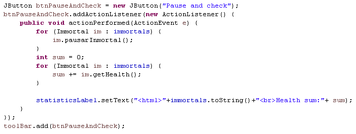

• Inmortal:
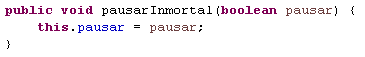
•ControlFrame
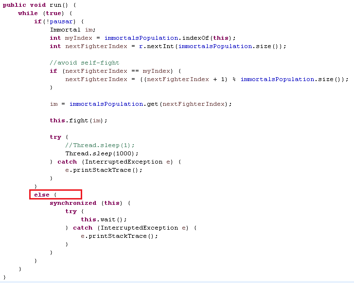

• Prueba:
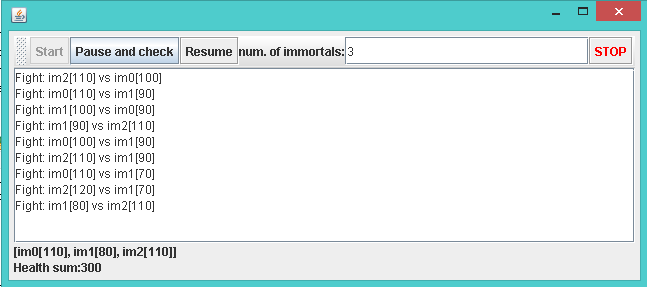	

>Reanudar:
• ControlFrame:
	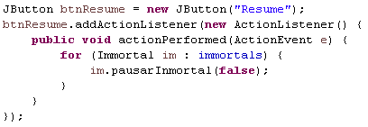

• Inmortal:
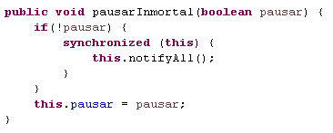
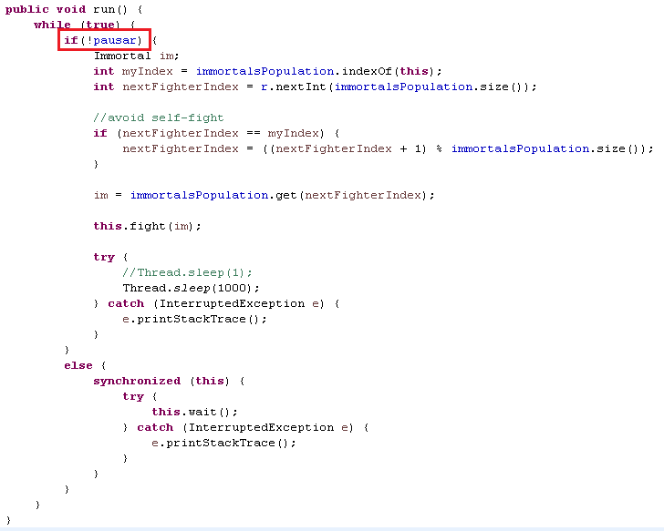

• Prueba:
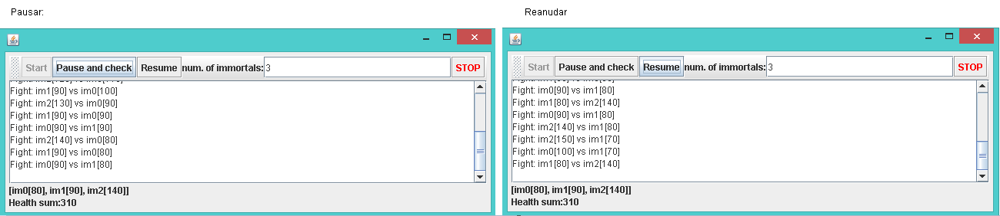

**5.** Verifica de nuevo la funcionalidad haciendo clic muchas veces. ¿Se satisface el invariante?
> No se satisface el invariante porque aún no se ha tratado la condición de carrera que existe en el momento en que dos inmortales se atacan al mismo tiempo.

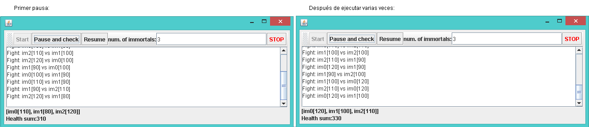

**6.** Identificar posibles regiones críticas con respecto a la lucha de los inmortales. Implementar una estrategia de bloqueo para evitar las condiciones de la carrera. Recuerde que si necesita usar dos o más 'bloqueos' simultáneamente, puede usar bloques sincronizados anidados.
> La región crítica se presenta cuando dos inmortales se atacan entre sí al mismo tiempo, porque se suma y resta a su salud al mismo tiempo.

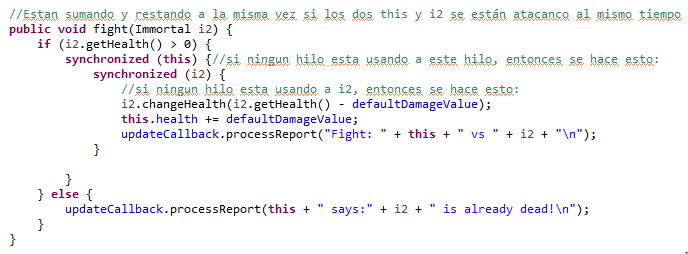
> Al ejecutar muchas veces el programa, se puede ver que ya se cumple el invariante, es decir que la suma de la salud de todos los inmortales, siempre es la misma.

7.Después de implementar su estrategia. Ejecuta el programa y presta atención si se detiene. En ese caso, use los programas jps y jstacks para identificar por qué el programa detiene su ejecución.
> En efecto, al ejecutar varias veces se detiene el programa y no continúa mostrando cambios. Esto debe a un deadlock el cual es causado porque los dos inmortales(hilos) se bloquean para siempre, ya que uno está a la espera del otro. Como ambos pueden atacarse, cada uno está necesitando los mismos recursos y en este caso los está  obteniendo en diferente orden.

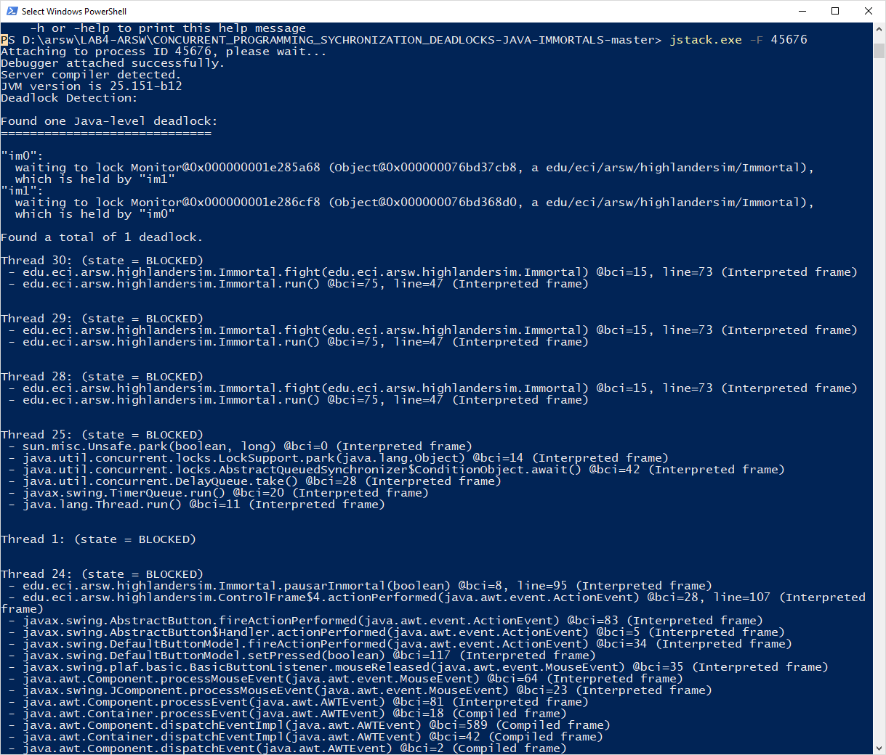

8. Piense en una estrategia para resolver el problema identificado (puede volver a consultar las 206 y 207 páginas de la "Concurrencia de Java en la práctica")
> Para solucionar el problema se debe mantener un orden a la hora de la sincronización, para esto se uso el método hasCode de cada hilo
> 

