## LAB4-Conceptos básicos de estilo de llamada / retorno (paralelismo y concurrencia)

Integrantes: 
		• Amalia Alfonso
		• Daniel Rosales

## Part I.I:
**1.** Ejecute y verifique cómo funciona el programa, Ejecute jVisualVM e inspeccione el uso de la CPU del proceso correspondiente.
¿Cuál es la razón de este consumo de CPU?
¿Cuál es la clase responsable de ese consumo?
> Este consumo se genera porque el Consumer mientras espera recursos no hace nada más hasta que que el producer agregue datos, es decir que se queda en una espera activa, por eso la clase responsable de ese alto consumo de CPU es la clase Consumer.
En el momento en que comienza a correr Consumer, aumenta el consumode la CPU:

> 

**2.** Escriba un código para resolver los problemas de uso de la CPU, teniendo en cuenta que por ahora la producción es lenta y el consumo es rápido, verifique que el consumo de la CPU haya disminuido.

> 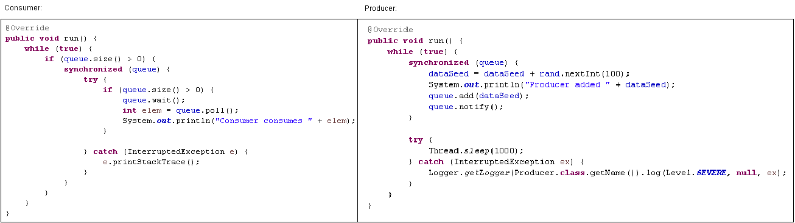

> 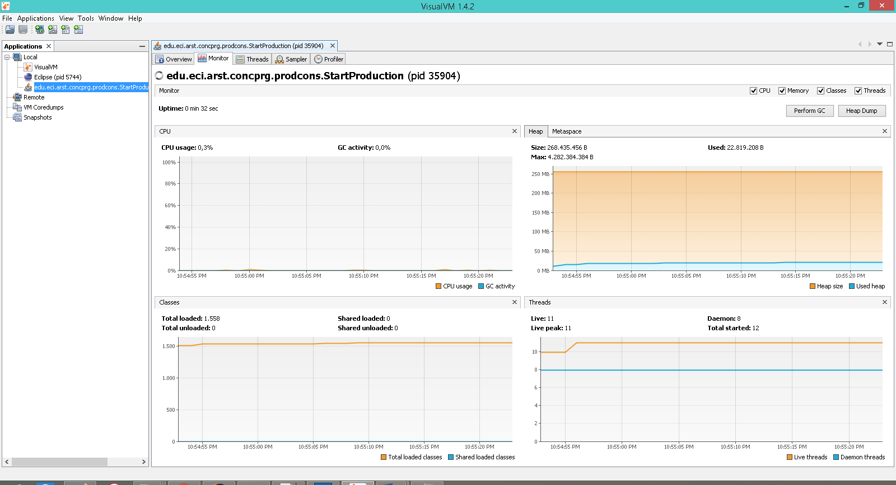
Código:

**3.** Haga un productor que produzca lo más rápido que pueda, y el consumidor consuma lentamente, teniendo en cuenta que el productor conoce un límite de Stock (cuántos elementos deben tener como máximo en la cola) su código debe respetar ese límite. Revise el La API de recopilación utilizada como cola para validar que no se exceda el límite. Verifique que cuando establezca un límite pequeño en el stock, no haya un alto consumo de CPU o errores. Así que, en conjunto, estamos explorando el total de servidores.

> 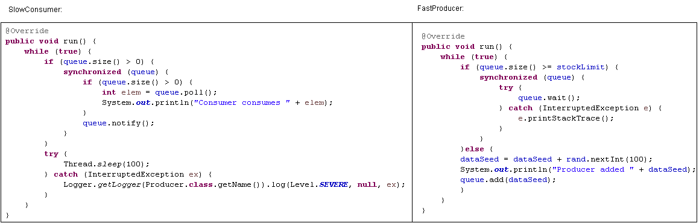

> 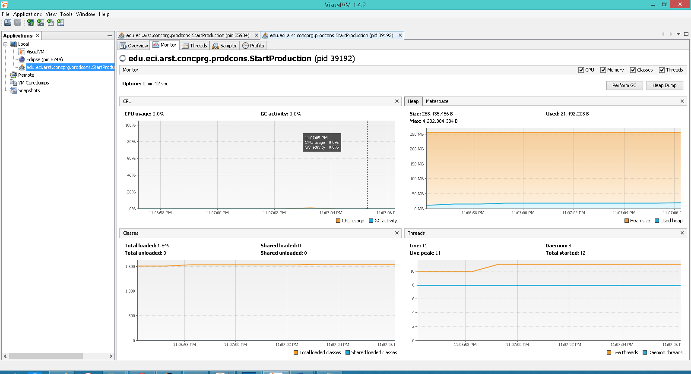

## Parte I.II:
Teniendo en cuenta el concepto de condición de carrera y la sincronización. Haga una nueva versión más eficiente del ejercicio anterior. (Búsqueda en la Lista Negra). En la versión actual, cada subproceso está a cargo de verificar el host en cada subconjunto de servidores que se le asigna. Así que, en conjunto explora el total de servidores.
Considerando esto:
1.Haga que la búsqueda distribuida se detenga (deje de mirar las listas negras restantes) y devuelva la respuesta cuando los subprocesos en su conjunto hayan detectado el número de ocurrencias necesarias para determinar si un host es confiable o no (BLACK_LIST_ALARM_COUNT)
2.Lo anterior, asegurando que no hay condiciones de carrera.

> Para solucionar esto se usaron variables atoóicas, de manera en que los hilos puedan acceder a ellas uno a la vez. También se hizo uso del join para que espere a que todos terminer para dar el resultado final (paralelismo), y todos terminan al detectar que entre todos ya completaron 5 ocurrencias consultadno la variable atómica ocurrencesCount.

> 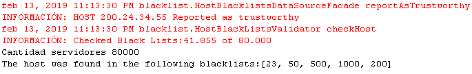

## Parte II:

**2.** Compruebe el código e identifique cómo se implementó la funcionalidad indicada. Dado el propósito del juego, un invariante debe ser que la suma de los puntos de vida de todos los jugadores sea siempre la misma. (Por supuesto, en un momento en el que no se está realizando una operación de aumento / reducción de tiempo) . Para ese caso, para los jugadores N, ¿cuál debería ser ese valor?

> En ese caso, el valor debería ser el número de jugadores N por el valor de la salud predeterminada. Es decir N*DEFAULT_IMMORTAL_HEALTH=100N

**3.** Ejecute la aplicación y verifique cómo funciona la opción "pausar y verificar", ¿está satisfecho el invariante?
> No está satisfecho el invariante porque no está deteniendo la ejecución de los inmortales. Además, hay datos corruptos porque no se están alterando correctamente los datos, dado que cualquier inmortal puede aumentar o disminuir su vida al tiempo. También se evidencia una condición de carrera porque al atacar aleatoriamente a cualquier inmortal, puede ocurrir que dos de ellos ataquen a un mismo objetivo(otro inmortal).

> 
> 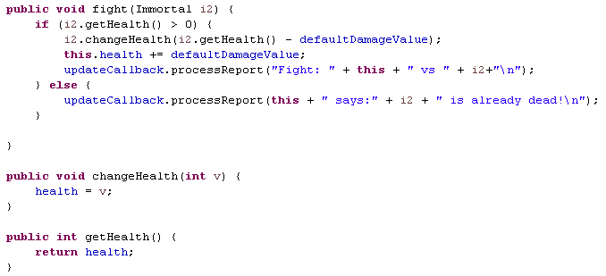

**4.** Una primera hipótesis para presentar la condición de carrera para esa función (pausar y verificar) es que el programa verifica la lista cuyos valores se van a imprimir, al mismo tiempo que otros subprocesos modifican los valores de la lista. Para resolver eso, escriba el código necesario para efectivamente, antes de imprimir los resultados actuales, pausar los otros hilos. Además, implementar la opción de reanudar.

>Pausar y Verificar:

• ControlFrame
> 

• Inmortal:
> 
•ControlFrame
> 

• Prueba:
> 	

>Reanudar:
• ControlFrame:
	

• Inmortal:
> 

>

• Prueba:
> 

**5.** Verifica de nuevo la funcionalidad haciendo clic muchas veces. ¿Se satisface el invariante?
> No se satisface el invariante porque aún no se ha tratado la condición de carrera que existe en el momento en que dos inmortales se atacan al mismo tiempo.

> 

**6.** Identificar posibles regiones críticas con respecto a la lucha de los inmortales. Implementar una estrategia de bloqueo para evitar las condiciones de la carrera. Recuerde que si necesita usar dos o más 'bloqueos' simultáneamente, puede usar bloques sincronizados anidados.
> La región crítica se presenta cuando dos inmortales se atacan entre sí al mismo tiempo, porque se suma y resta a su salud al mismo tiempo. En el código, se presenta en el método fight en donde se cambian la salud de cada hilo. Si se atacan mutuamente, deben ser sincronizados para que  los recursos no se alteren corruptamente y solo se puedan alterar por un hilo, hasta que el lock indique que el recurso está desbloqueado y otro hilo puede acceder a él.
> 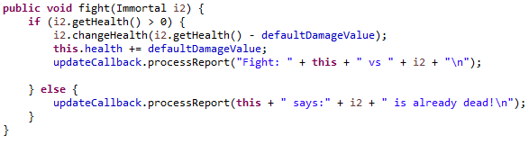

> 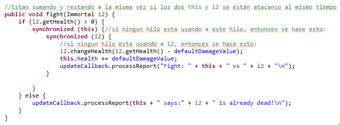
> Al ejecutar muchas veces el programa, se puede ver que ya se cumple el invariante, es decir que la suma de la salud de todos los inmortales, siempre es la misma.

**7.** Después de implementar su estrategia. Ejecuta el programa y presta atención si se detiene. En ese caso, use los programas jps y jstacks para identificar por qué el programa detiene su ejecución.
> En efecto, al ejecutar varias veces se detiene el programa y no continúa mostrando cambios. Esto debe a un deadlock el cual es causado porque los dos inmortales(hilos) se bloquean para siempre, ya que uno está a la espera del otro. Como ambos pueden atacarse, cada uno está necesitando los mismos recursos y en este caso los está  obteniendo en diferente orden.
> 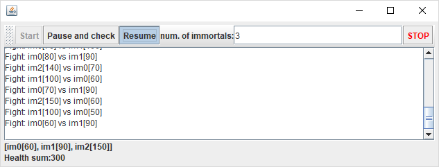
> 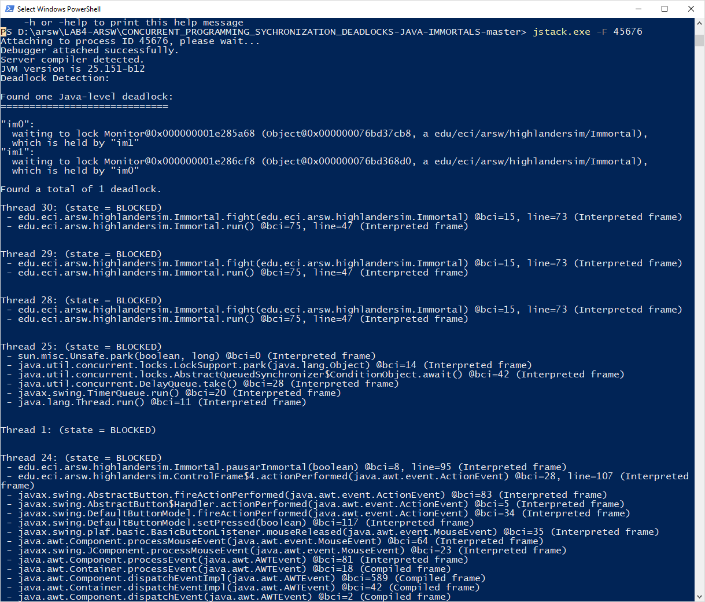

**8.** Piense en una estrategia para resolver el problema identificado (puede volver a consultar las 206 y 207 páginas de la "Concurrencia de Java en la práctica")
> Para solucionar el problema se debe mantener un orden a la hora de la sincronización, para esto se usa el método hasCode de cada hilo, ya que así se podrá conocer el valor entero, generado por un algoritmo de hashing, el cual es único para cada objeto. También se puede usar el método  getId() de cada hilo, el cual devuelve un identificador asignado a cada uno en el momento de su creación. Con éstos valores se pueden sincronizar los hilos siempre en el mismo.

> 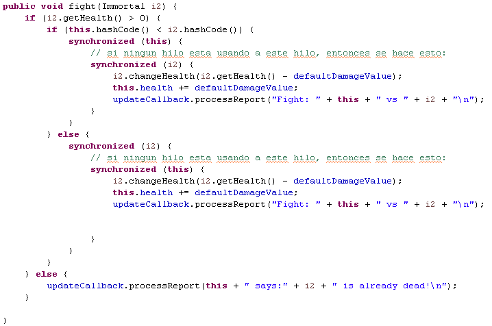

**9.** Cuando haya resuelto el problema, verifique que el programa continúe trabajando con coherencia al ejecutar 100,1000 o 10000 inmortales. Si con gran cantidad de inmortales vuelves a romper el invariante. Tienes que analizarlo de nuevo (paso 4)

> Al momento de ejecutar, el invariante aún no está satisfecho, y es porque se deben actualizar las llamadas de regreso después de terminar las dos sincronizaciones.
Una vez cambiado el momento en que se actualiza CallBack, se puede ver que el invariante se mantiene igual.

> 

>Ahora sí se peude ver que siempre se se cumple el invariante:

> 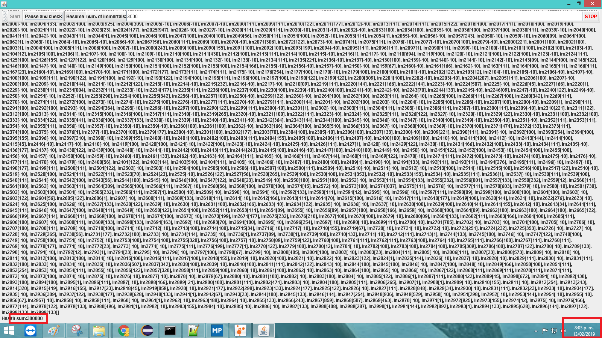

> 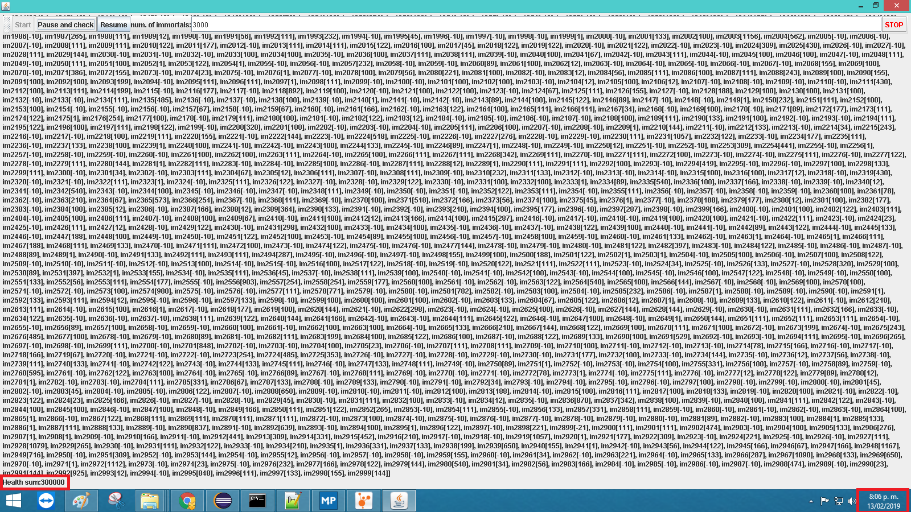

Con 10.000 inmortales:
> 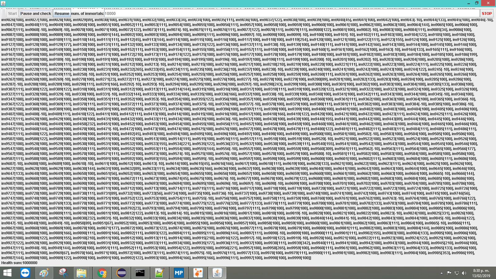

**10.** Un elemento molesto de la simulación, que es cierto punto de la misma, hay pocos inmortales vivos que luchan con inmortales muertos. Es necesario eliminar a los inmortales muertos en la simulación cuando están muriendo, para eso:

Analizando cómo funciona la simulación. Esto podría crear una condición de carrera? Implemente la funcionalidad, ejecute la simulación y observe qué problema se presenta cuando hay muchos inmortales. Escriba algunas conclusiones en el archivo Answers.txt

Resuelva el problema identificado anteriormente sin uso Sincronización, ya que la secuencia del proceso haría la simulación extremadamente lenta.

> Al resolver el problema no presentamos dificultades, y se puede evidenciar su correcto funcionamiento, porque al ejecutar el programa se puede ver como disminuyen los inmortales a medida que van muriendo. Cuando son muchos inmortales toma mucho tiempo porque la salud total, está dividida entre unos pocos, entonces acabar con la de alguno es más complicado. Cuando son pocos se puede ver rápidamente que finalmente solo quedan dos inmortales azacanasen infinitamente.

> 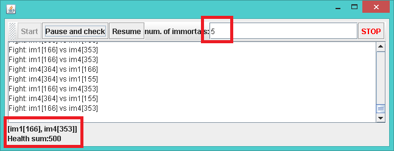

> 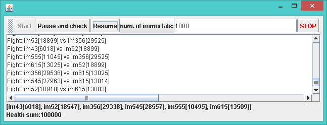

**11.** Finalmente, implementar la opción STOP.

> 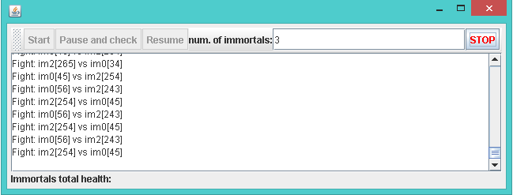

