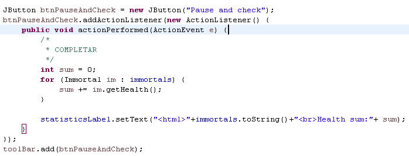
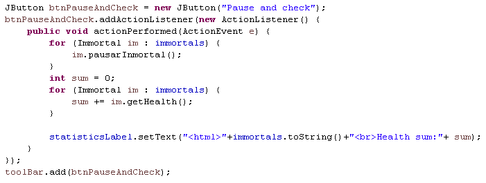
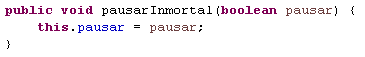
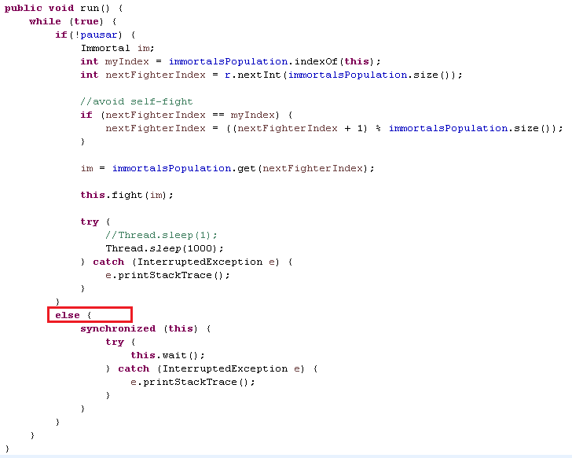
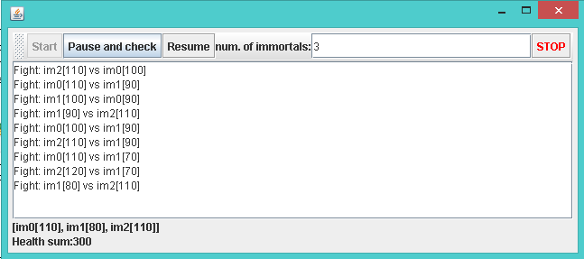
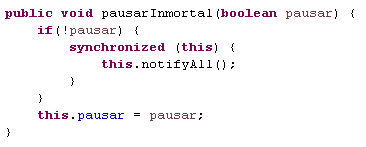
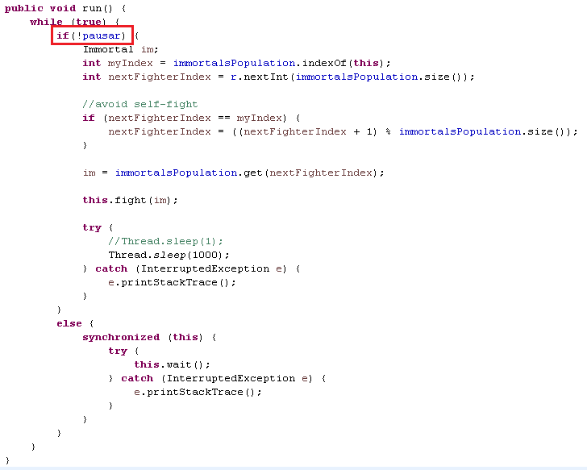
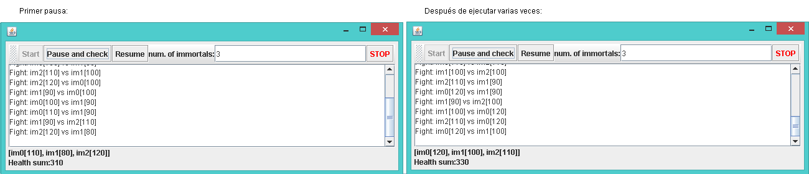

###LAB4-ARSW

2.Compruebe el código e identifique cómo se implementó la funcionalidad indicada. Dado el propósito del juego, un invariante debe ser que la suma de los puntos de vida de todos los jugadores sea siempre la misma. (Por supuesto, en un momento en el que no se está realizando una operación de aumento / reducción de tiempo) . Para ese caso, para los jugadores N, ¿cuál debería ser ese valor?

Rta= En ese caso, el valor debería ser el número de jugadores N por el valor de la salud predeterminada. Es decir N*DEFAULT_IMMORTAL_HEALTH=100N

3. Ejecute la aplicación y verifique cómo funciona la opción "pausar y verificar", ¿está satisfecho el invariante?
No está satisfecho el invariante porque no está deteniendo la ejecución de los inmortales. Además hay datos corruptos porque no se están alterando correctamente los datos ya que cualquier inmortal puede aumentar o disminuir su vida al tiempo sin tener en cuenta concurrencia, porque nose tiene en cuenta que si están atacando a algún inmortal, ese no debería poder atacar. También se evidencia una condición de carrera porque al atacar aleatoriamente a cualquier inmortal, puede ocurrir que dos de ellos ataquen a un mismo objetivo(otro inmortal).

4. Una primera hipótesis para presentar la condición de carrera para esa función (pausar y verificar) es que el programa verifica la lista cuyos valores se van a imprimir, al mismo tiempo que otros subprocesos modifican los valores de la lista. Para resolver eso, escriba el código necesario para efectivamente, antes de imprimir los resultados actuales, pausar los otros hilos. Además, implementar la opción de reanudar.

Pausar y Verificar:

	ControlFrame

	Inmortal:

	Prueba:

Reanudar:
	ControlFrame:

	Inmortal:

	Prueba:

5.Verifica de nuevo la funcionalidad haciendo clic muchas veces. ¿Se satisface el invariante?
No se satisface el invariante porque aún no se ha tratado la condición de carrera que existe en el momento en que dos inmortales atacan a un mismo objetivo(otro inmortal) ya que se atacan aleatoriamente.

6.Identificar posibles regiones críticas con respecto a la lucha de los inmortales. Implementar una estrategia de bloqueo para evitar las condiciones de la carrera. Recuerde que si necesita usar dos o más 'bloqueos' simultáneamente, puede usar bloques sincronizados anidados.
La región crítica se presenta cuando dos inmortales se atacan así mismos, porque se suma y resta a su salud al mismo tiempo.
12-condicionDeCarrrera.PNG
13-synchronized.PNG
Al ejecutar muchas veces el programa, se puede ver que ya se cumple el invariante, es decir que la suma de la salud de todos los inmortales, siempre es la misma.
14-pruebaSynchronized

7.Después de implementar su estrategia. Ejecuta el programa y presta atención si se detiene. En ese caso, use los programas jps y jstacks para identificar por qué el programa detiene su ejecución.
En efecto, al ejecutar varias veces, aparte de que se cumple el invariante se detiene el programa y n ocontinúa mostrando cambios.
15-synchronizedBloqueoMortal

